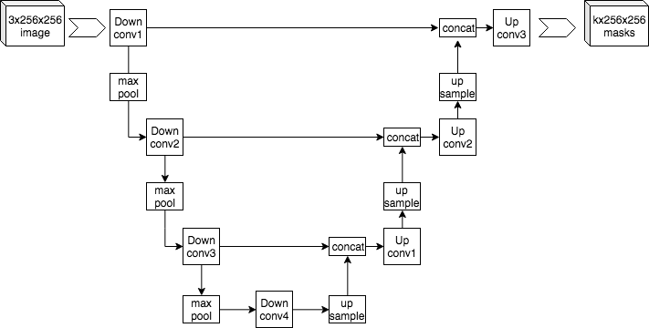
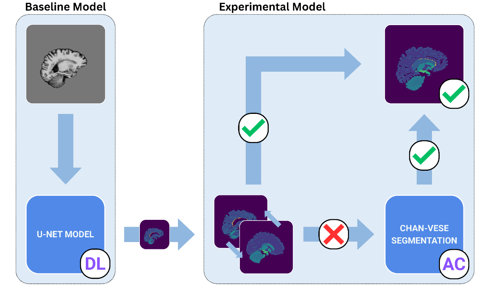
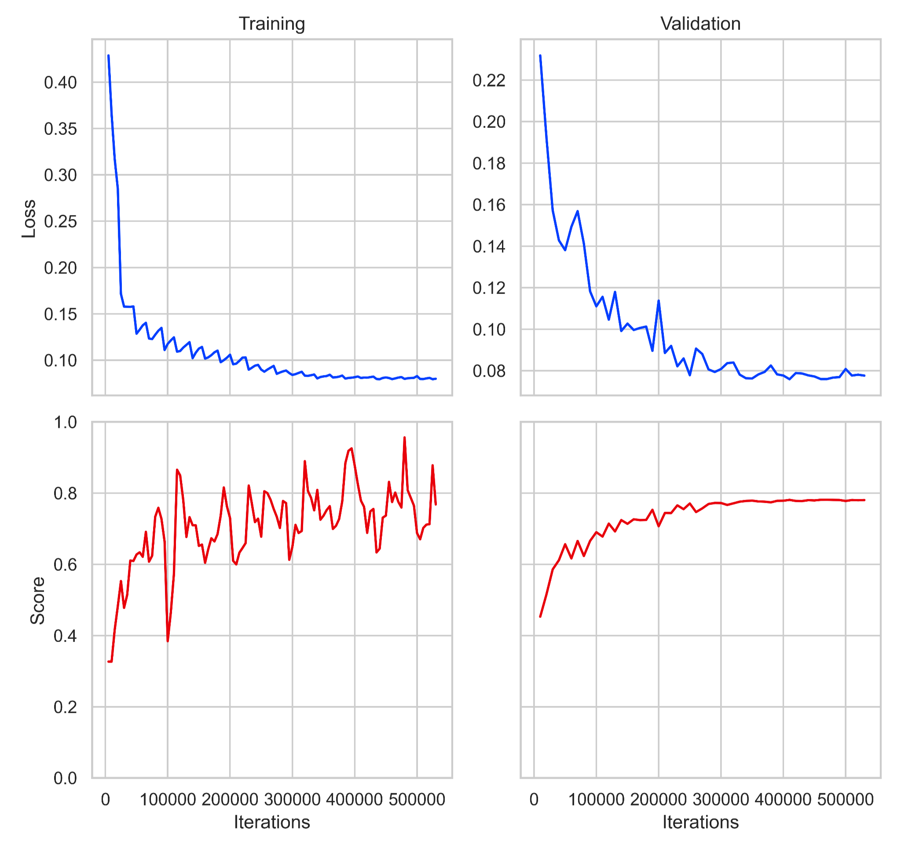
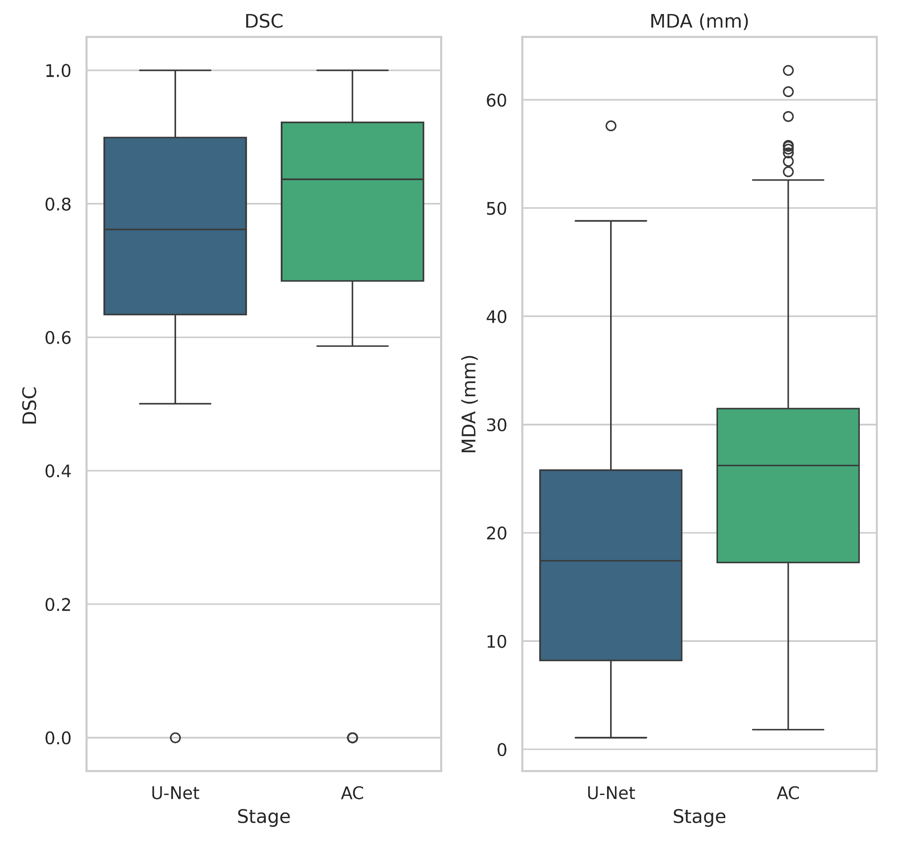

# DuoContour: modular hybrid segmentation for automated MRI contouring

### Liv V. Sullivan

---

**In order to take full advantage of MRI scans, the position of important tissues and structures must be known. This research presents a combination of deep learning and active contour, which have been shown to improve accuracy when used together. Preprocessed images were fed into a U-Net, the output of which was used as a baseline. In the experimental component, the output of the U-Net was compared against an atlas using the Dice similarity coefficient (DSC), a measure of volumetric overlap. Those with a high DSC were output directly, and those with a low DSC were modified using Chan-Vese segmentation, which was then output. The model's performance was analyzed using DSC and mean distance to agreement (MDA), a measure of distance between contour boundaries. While mean DSC increased by 7.79% (+0.06) after the experimental component, MDA also increased by 45.1% (8.2 mm). The IQR for DSC and MDA also fell 16% and 20.1%, respectively. The experimental algorithm is shown to result in higher volumetric overlap and consistency across samples, but also less accurate boundaries around contours.**

***Keywords:*** *atlas, U-Net, deep learning, Chan-Vese segmentation, active contour*

---

The specific anatomy of a patient's brain is incredibly useful for physicians when diagnosing illnesses and designing treatment plans. Doctors often use medical imaging techniques such as magnetic resonance imaging (MRI) to model internal parts of the body where such visualization might otherwise be impossible. These algorithms and the information they provide can be used to identify problems with the body by revealing swelling, inflammation, the presence of tumors, or other insights. However, in order to maximize the value of these scans, radiologists often identify and label regions of interest (ROIs) such as bones, organs, and tumors in a process known as contouring (Baroudi et al., 2023). However, this process, when done manually, can take several hours for each patient depending on the number of ROIs (P. Sullivan, personal communication, September 8, 2025).
In recent years, many algorithms to assist with contouring have been developed using principles of image segmentation adapted to 3D scans (Fischl et al., 2002, 2004; Fu et al., 2018, Zhang et al, 2001, 2019). The use of these programs can help save radiologists time when contouring a large volume of scans, therefore reducing the load and tedium associated with the process. Many automated contouring algorithms use neural networks and deep learning (DL) approaches to process a large amount of data efficiently (Billot, Magdamo, et al., 2023; Coupé et al., 2020; Fu et al., 2018; Ng et al, 2022; Zhao et al, 2022).
One such method that has resulted in significant success is the use of U-Nets, a type of convolutional neural network named for its U-shape (Fig. 1) due to its use of pooling downsampling followed by upscaling—essentially blurring and re-increasing the image resolution, creating a more fuzzy, generalized image to be used alongside sharper images—to improve its recognition of patterns (Çiçek et al., 2016; Coupé et al., 2020) and known for its ability to segment a variety of types of images. This success is partially due to the U-Net's ability to identify and generalize patterns, as well as its ability to use 3-dimensional analysis to work with entire images at once instead of splitting them up into 2-dimensional slices (Billot, Greve, et al., 2023).

<small>**Figure 1.** Visualization of the steps of a U-Net. The example image, a 256x256 RGB image, is downscaled four times, and then upsampled four times to create k masks of the original resolution. Courtesy of Yazdani (2019).</small>

In addition to DL techniques, many contouring algorithms use classical techniques such as active contour (AC), which involves drawing curves around edges in the image to separate different areas, or atlas-based segmentation, in which a selection of images are overlaid on each other and contoured to create an "atlas" against which other images can be compared. These techniques are often used to reduce computational demand (Almijalli et al., 2025; Ding et al., 2022; Gibbons et al., 2022; Ng et al., 2022). The advantage of using non-training methods is that they require less computational power and do not require the same training datasets of hundreds of samples that are required by DL approaches. These approaches can reach similar performance levels to DL-based methods (Almijalli et al., 2025), but may also be less generalizable to other data (Ng et al., 2022).
In order to balance the advantages and disadvantages of both approaches, some research has used a combination of DL and classical methods. Coupé et al. (2020) used U-Nets to create an MRI segmentation framework inspired by parliamentary systems. The proposed model used a combination of transfer learning, atlas-based segmentation, and connected coarse and fine decision contouring steps to achieve high accuracy in a more efficient process. Makaroff & Cohen (2023) designed an attention mechanism using the Chan-Vese AC algorithm to improve a DL pipeline, and found increased accuracy and speed. However, these algorithms are often more structurally and computationally complex than either type of approach by itself.
In order to assess the accuracy of automated contouring algorithms, researchers have used a variety of metrics. One such metric is the Dice Similarity Coefficient (DSC) (Brock et al., 2017; Ding et al., 2022; Lei et al., 2021; Ng et al., 2022), which measures the amount of overlap between two volumes:
$$DSC=\frac{2|S_1 \cap S_2|}{|S_1| + |S_2|}$$
where $S_1$ is the set of points in the ground truth contour, and $S_2$ is the set of points on the predicted contour.
Researchers have also used Mean Distance to Agreement (MDA) (Brock et al., 2017; Ding et al., 2022), a measurement of the average distance between each point on one contour and the corresponding point on the opposite contour:
$$MDA=\frac{1}{|S_1|}\sum_{i=1}^{|S_1|} d(p_i, S_2)$$
where $d(p_i, S2)$ is the distance between point $p_i$ in $S_1$ and the nearest point in $S_2$.
These metrics have been shown to accurately measure the performance of automated contouring algorithms (Brock et al., 2017) and will therefore be used to assess the accuracy of the proposed model.
The focus of this research was to develop an efficient, accurate algorithm to automatically create contours for MRI scans of the human brain using a combination of DL and classical image segmentation methods. DL algorithms such as U-Nets, while useful on their own, have been shown to benefit from being used in combination with classical segmentation methods when applied to medical images (Ding et al., 2022). Based on these findings, an algorithm has been developed that uses the Chan-Vese active contour algorithm to correct the results of a 3D U-Net-based DL model to create an automated contouring algorithm that can be run quickly and efficiently on consumer hardware such as desktop processors.

## Methods

### Dataset Creation
In order to establish a dataset to work with, images were downloaded from the Open Access Series of Imaging Studies (OASIS) (Marcus et al., 2007) (n=416), and from the Child and Adolescent NeuroDevelopment Initiative (CANDI) (Frazier et al., 2008; Kennedy et al., 2011) (n=102). Each image from these databases was paired with a human-made contour which was used as the ground truth. These datasets were chosen because of their size and availability, as well as their inclusion of whole-brain contours rather than tumor segmentation alone. Images were analyzed both by the database curators and the researcher using FreeSurfer, a free medical image analysis software. Each image was represented by a FreeSurfer MGH file containing a header and a 256x256x256 voxel array representing the image. Contour data was contained in a separate MGH file of the same size, where each contour region was represented by a different value as determined by FreeSurfer. The RB_all_2008-03-26.gca atlas was also downloaded from FreeSurfer to be used in later stages.
Before images could be input into the contouring algorithm, they were preprocessed to minimize differences in orientation, intensity ranges, and other potentially confounding factors that could interfere with the performance of the algorithm. Each image was subject to the following preprocessing steps, in order:
1. Pad or scale images to 256x256x256 voxels if necessary
2. Register images to the MNI152 standard space (Fonov et al., 2011; Fonov et al., 2009) to ensure uniform positioning
3. Perform N4 bias field correction, following Billot, Greve, et al. (2023)
4. Z-score intensity normalization, following Schmid (2023)
5. Imputation of unknown or incorrect labels
6. Transform labels from FreeSurfer values to continuous values on [0, 38]
7. Reorient image arrays to better suit Python slicing

The set of preprocessed images was randomly divided into training, testing, and validation sets, with sizes of 70%, 15%, and 15% of the total image set, respectively. This ensured that there would be enough training and validation data to create a model that accurately identified patterns and created high-quality contours while leaving enough testing data to conclusively determine the accuracy of the model.

### Baseline Component Analysis

The DL component of the algorithm was created using a 3D U-Net library created by Wolny et al. (2020) and based on Lee et al. (2017) using the Python programming language, and implemented using the PyTorch deep learning library, which allows for GPU acceleration. The DL model was run on an NVIDIA GeForce RTX 5070 GPU with 12 gigabytes of memory. To balance training time with memory usage, images were split into 45 chunks of 128x96x128 voxels each, with a stride of 64x48x64 between chunks. 
In order to establish a baseline against which to compare the performance of the experimental model, the DL component was analyzed alone (Fig. 2). While this was not a perfect representation of the tools currently available for medical image contouring, it allowed comparison between the performance of DL alone compared to DL and AC together. Training images were input to the DL model, and the accuracy of the resulting contours were compared to the ground truth labels using DSC and MDA.

<small>**Figure 2.** Baseline and experimental models. The baseline model consists of the deep learning (DL) model alone, where preprocessed images are input directly into the DL component, and the resulting contours are final. In the experimental model, the output of the DL component is compared against an atlas using the Dice similarity coefficient (DSC). If the DSC is higher than 0.5, the contour is output as the final contour. If the DSC is less than 0.5, the contour is run through active contour (AC) and the resulting contour is output as the final contour.</small>

### Experimental Component Analysis
After analyzing the performance of the DL algorithm, both the DL and AC components were analyzed together in the experimental model. The AC algorithm used in this research was the Chan-Vese segmentation algorithm, implementing using the scikit-image Python package. The algorithm was used with its default parameters in all cases in order to ensure consistency across trials. To analyze if AC was necessary, the output of the DL model was compared against the FreeSurfer atlas using DSC. If the DSC was greater than 0.5, the contour was determined to be accurate and output as the final contour for its corresponding input image. If the DSC was less than 0.5, the image was passed into the AC component where it underwent Chan-Vese segmentation (Chan & Vese, 2001). The DL contour was used as the algorithm's initial level set, which provided it with a starting contour to work from, similar to seeding. The output of the AC algorithm was then output as the final contour. Accuracy of the experimental model was also assessed using DSC and MDA.

## Results

The DL model reached a minimum loss of 0.075 after 48 epochs, or 410,000 iterations. Throughout validation, DSC increased smoothly before plateauing around a maximum value of 0.77 after 54 epochs, or 560,000 iterations (Fig. 3).
The experimental algorithm (DL and AC components) showed an approximately 7.79% increase (+0.06) in mean DSC compared to the baseline algorithm (DL alone). However, mean MDA also increased by approximately 45.1% (+8.2 mm) (Table 1). Median measurements followed a similar trend, with DSC increasing from 0.76 after DL alone to 0.84 after both DL and AC, and MDA increasing from 17.8 to 26.2 mm. The IQR of both metrics decreased: DSC went from 0.25 to 0.21 (-16%), and MDA fell from 17.4 to 13.9 mm (-20.1%) (Fig. 4).

<small>**Figure 3.** Loss and evaluation score vs. iteration for training and validation of the baseline mode. The model reached a minimum loss of 0.075 after 48 epochs (410,000 iterations) and a maximum mean DSC of 0.77 after 54 epochs (560,000 iterations).</small>

<small>**Table 1.** Mean DSC (higher is better) and MDA (lower is better) values for baseline and experimental models.</small>

| Metric | Baseline (DL) | Experimental (DL + AC) | % Change |
|---|---|---|---|
| DSC | 0.77 | 0.83 | +7.79% |
| MDA | 18.2 mm | 26.4 mm | +45.1% |

<small>**Figure 4.** DSC and MDA after U-Net (DL) contouring alone and after both DL and AC stages. Median DSC increased from 0.76 to 0.84, and the IQR decreased from 0.25 to 0.21. Median MDA increased from 17.8 to 26.2 mm, and the IQR decreased from 17.4 to 13.9 mm.</small>

## Discussion

The baseline component of the model, despite not performing as well as other algorithms, provided a realistic benchmark to compare the experimental model against. With a mean DSC of 0.77 and MDA of 18.2 mm (Table 1), the baseline model showed a higher DSC than Coupé et al. (2020) (DSC 73.9; MDA 0.838) on the same OASIS and CANDI datasets, albeit also with a higher MDA. Because of this, the baseline model was assumed to be an acceptable representation of the currently available automated contour tools.
The reason why DSC improved but MDA worsened is unclear, but it may have resulted from incorrectly tuned Chan-Vese segmentation. The default sensitivity of the algorithm may have been poor for this use case, which could be confirmed through additional experimentation. However, future work is required to solve this issue conclusively.
Because mean DSC and MDA both increased after AC, the data was interpreted as showing that the volumes of the predicted contour and the ground truth contour became more closely aligned, but with a negative impact on the shape of the boundary of the predicted contour. Because of this, the performance of the experimental model cannot be interpreted as solely improving or worsening, and future research is needed to improve the MDA of this algorithm. The smaller IQRs of the experimental model for both DSC and MDA suggest the introduction of AC makes the algorithm more consistent.
Future work on this algorithm is needed to properly analyze the reason why DSC improved while MDA worsened, and resolve the issue. This could involve replacing the U-Net with more advanced algorithms such as AssemblyNet (Coupé et al., 2020), or a random forest classifier (Lei et al., 2021). The Chan-Vese algorithm could be replaced with other methods of active contour, such as watershed or random walker segmentation. These different algorithms could have an impact on the performance of the model with respect to both its accuracy and efficiency, and could help improve MDA due to increased complexity or higher focus on the volume of the contours rather than their borders.
In conclusion, the proposed algorithm has been shown to achieve higher mean DSC than the baseline, but also a higher MDA. Because of the simplified nature of this algorithm, it is important to determine its performance when using more advanced tools, as in addition to potentially improving performance, they may also have effects on the speed and variability of the model.

## References

Almijalli, M., Almusayib, F. A., Albugami, G. F., Aloqalaa, Z., Altwijri, O., & Saad, A. S. (2025). Automatic active contour algorithm for detecting early brain tumors in comparison with AI detection. Processes, 13(3), 867-867. MDPI. https://doi.org/10.3390/pr13030867 
Baroudi, H., Brock, K. K., Cao, W., Chen, X., Chung, C., Court, L. E., El Basha, M. D., Farhat, M., Gay, S., Gronberg, M. P., Gupta, A. C., Hernandez, S., Huang, K., Jaffray, D. A., Lim, R., Marquez, B., Nealon, K., Netherton, T. J., Nguyen, C. M., & Reber, B. (2023). Automated contouring and planning in radiation therapy: What is "clinically acceptable"?. Diagnostics, 13(4), 667. PubMed. https://doi.org/10.3390/diagnostics13040667 
Billot, B., Greve, D. N., Puonti, O., Thielscher, A., Van Leemput, K., Fischl, B., Dalca, A. V., & Iglesias, J. E. (2023). SynthSeg: Segmentation of brain MRI scans of any contrast and resolution without retraining. Medical Image Analysis, 86, 102789. ScienceDirect. https://doi.org/10.1016/j.media.2023.102789 
Billot, B., Magdamo, C., Cheng, Y., Arnold, S. E., Das, S., & Eugenio Iglesias, J. (2023). Robust machine learning segmentation for large-scale analysis of heterogeneous clinical brain MRI datasets. Proceedings of the National Academy of Sciences of the United States of America, 120(9). https://doi.org/10.1073/pnas.2216399120 
Brock, K. K., Mutic, S., McNutt, T. R., Li, H., & Kessler, M. L. (2017). Use of image registration and fusion algorithms and techniques in radiotherapy: Report of the AAPM Radiation Therapy Committee Task Group No. 132. Medical Physics, 44(7), e43-e76. American Association of Physicists in Medicine. https://doi.org/10.1002/mp.12256 
Chan, T. F., & Vese, L. A. (2001). Active contours without edges. IEEE Transactions on Image Processing, 10(2), 266-277. IEEE Xplore. https://doi.org/10.1109/83.902291 
Çiçek, Ö., Abdulkadir, A., Lienkamp, S. S., Brox, T., & Ronneberger, O. (2016). 3D U-Net: Learning dense volumetric segmentation from sparse annotation. arXiv. https://doi.org/10.48550/arXiv.1606.06650 
Coupé, P., Mansencal, B., Clement, M., Giraud, R., Denis de Senneville, B., Ta, V.-T., Lepetit, V., & Manjón, J. V. (2020). AssemblyNet: A large ensemble of CNNs for 3D whole brain MRI segmentation. NeuroImage, 219, 117026. ScienceDirect. https://doi.org/10.1016/j.neuroimage.2020.117026 
Ding, J., Zhang, Y., Amjad, A., Xu, J., Thill, D., & Li, X. A. (2022). Automatic contour refinement for deep learning auto-segmentation of complex organs in MRI-guided adaptive radiation therapy. Advances in Radiation Oncology, 7(5), 100968. ScienceDirect. https://doi.org/10.1016/j.adro.2022.100968 
Fischl, B., Salat, D. H., Busa, E., Albert, M., Dieterich, M., Haselgrove, C., van der Kouwe, A., Killiany, R., Kennedy, D., Klaveness, S., Montillo, A., Makris, N., Rosen, B., & Dale, A. M. (2002). Whole brain segmentation: Automated labeling of neuroanatomical structures in the human brain. Neuron, 33(3), 341-355. ScienceDirect. https://doi.org/10.1016/s0896-6273(02)00569-x 
Fischl, B., Salat, D. H., van der Kouwe, A. J. W., Makris, N., Ségonne, F., Quinn, B. T., & Dale, A. M. (2004). Sequence-independent segmentation of magnetic resonance images. NeuroImage, 23(1), S69-84. ScienceDirect. https://doi.org/10.1016/j.neuroimage.2004.07.016 
Fonov, V., Evans, A. C., Botteron, K., Almli, C. R., McKinstry, R. C., & Collins, D. L. (2011). Unbiased average age-appropriate atlases for pediatric studies. NeuroImage, 54(1), 313-327. ScienceDirect. https://doi.org/10.1016/j.neuroimage.2010.07.033 
Fonov, V., Evans, A., McKinstry, R., Almli, C., & Collins, D. (2009). Unbiased nonlinear average age-appropriate brain templates from birth to adulthood. NeuroImage, 47(Suppl 1), S102. ScienceDirect. https://doi.org/10.1016/s1053-8119(09)70884-5 
Frazier, J. A., Hodge, S. M., Breeze, J. L., Giuliano, A. J., Terry, J. E., Moore, C. M., Kennedy, D. N., Lopez-Larson, M. P., Caviness, V. S., Seidman, L. J., Zablotsky, B., & Makris, N. (2008). Diagnostic and sex effects on limbic volumes in early-onset bipolar disorder and schizophrenia. Schizophrenia Bulletin, 34(1), 37-46. PubMed. https://doi.org/10.1093/schbul/sbm120 
Fu, Y., Mazur, T. R., Wu, X., Liu, S., Chang, X., Lu, Y., Li, H., Kim, H. J., Roach, M. C., Henke, L. E., & Yang, D. (2018). A novel MRI segmentation method using CNN-based correction network for MRI-guided adaptive radiotherapy. Medical Physics, 45(11), 5129-5137. https://doi.org/10.1002/mp.13221 
Gibbons, E., Hoffmann, M., Westhuyzen, J., Hodgson, A., Chick, B., & Last, A. (2022). Clinical evaluation of deep learning and atlas-based auto-segmentation for critical organs at risk in radiation therapy. Journal of Medical Radiation Sciences, Suppl 2(Suppl 2), 15-25. https://doi.org/10.1002/jmrs.618 
Kennedy, D. N., Haselgrove, C., Hodge, S. M., Rane, P. S., Makris, N., & Frazier, J. A. (2011). CANDIShare: A resource for pediatric neuroimaging data. Neuroinformatics, 10(3), 319-322. NITRC. https://doi.org/10.1007/s12021-011-9133-y 
Lee, K., Zung, J., Li, P., Jain, V., & Sebastian, S. H. (2017). Superhuman accuracy on the SNEMI3D Connectomics Challenge. ArXiv.org. https://arxiv.org/abs/1706.00120 
Lei, Y., Wang, T., Dong, X., Tian, S., Liu, Y., Mao, H., Curran, W. J., Shu, H.-K., Liu, T., & Yang, X. (2021). MRI classification using semantic random forest with auto-context model. Quantitative Imaging in Medicine and Surgery, 11(12), 4753-4766. https://doi.org/10.21037/qims-20-1114 
Makaroff, N., & Cohen, L. D. (2023). Chan-Vese attention U-Net: An attention mechanism for robust segmentation. arXiv. https://doi.org/10.48550/arXiv.2306.16098 
Marcus, D. S., Wang, T. H., Parker, J., Csernansky, J. G., Morris, J. C., & Buckner, R. L. (2007). Open access series of imaging studies (OASIS): Cross-sectional MRI data in young, middle aged, nondemented, and demented older adults. Journal of Cognitive Neuroscience, 19(9), 1498-1507. MIT Press Direct. https://doi.org/10.1162/jocn.2007.19.9.1498 
Ng, C., Leung, V. W. S., & Hung, R. H. M. (2022). Clinical evaluation of deep learning and atlas-based auto-contouring for head and neck radiation therapy. Applied Sciences, 12(22), 11681-11681. MDPI. https://doi.org/10.3390/app122211681 
Schmid, S. (2023, September 1). Image intensity normalization in medical imaging. Medium. https://medium.com/@susanne.schmid/image-normalization-in-medical-imaging-f586c8526bd1 
Sullivan, P. (2025, September 8). [Interview with Liv Sullivan]. 
Wolny, A., Cerrone, L., Vijayan, A., Tofanelli, R., Barro, A. V., Louveaux, M., Wenzl, C., Strauss, S., Wilson-Sánchez, D., Lymbouridou, R., Steigleder, S. S., Pape, C., Bailoni, A., Duran-Nebreda, S., Bassel, G. W., Lohmann, J. U., Tsiantis, M., Hamprecht, F. A., Schneitz, K., & Maizel, A. (2020). Accurate and versatile 3D segmentation of plant tissues at cellular resolution. ELife, 9, e57613. https://doi.org/10.7554/eLife.57613 
Yazdani, M. (2019). Example architecture of U-Net for producing k 256-by-256 image masks for a 256-by-256 RGB image. In Wikimedia Commons. 
Zhang, Y., Brady, M., & Smith, S. (2001). Segmentation of brain MR images through a hidden Markov random field model and the expectation-maximization algorithm. IEEE Transactions on Medical Imaging, 20(1), 45-57. IEEE Xplore. https://doi.org/10.1109/42.906424 
Zhang, Y., Plautz, T. E., Hao, Y., Kinchen, C., & Li, X. A. (2019). Texture-based, automatic contour validation for online adaptive replanning: A feasibility study on abdominal organs. Medical Physics, 46(9), 4010-4020. https://doi.org/10.1002/mp.13697 
Zhao, C., Duan, Y., & Yang, D. (2022). Contour interpolation by deep learning approach. Journal of Medical Imaging, 9(6). PubMed. https://doi.org/10.1117/1.jmi.9.6.064003 
